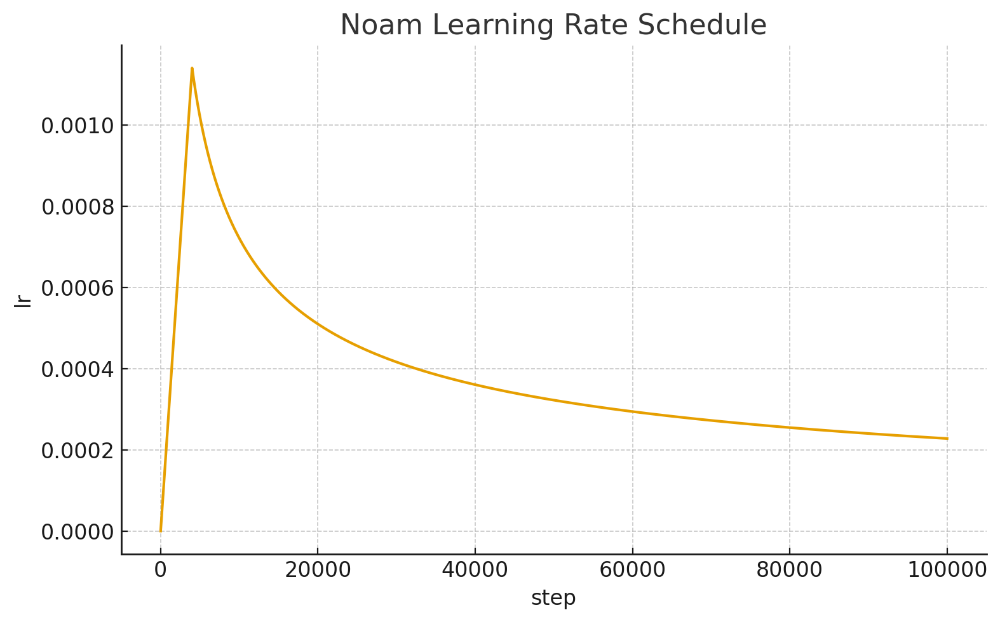
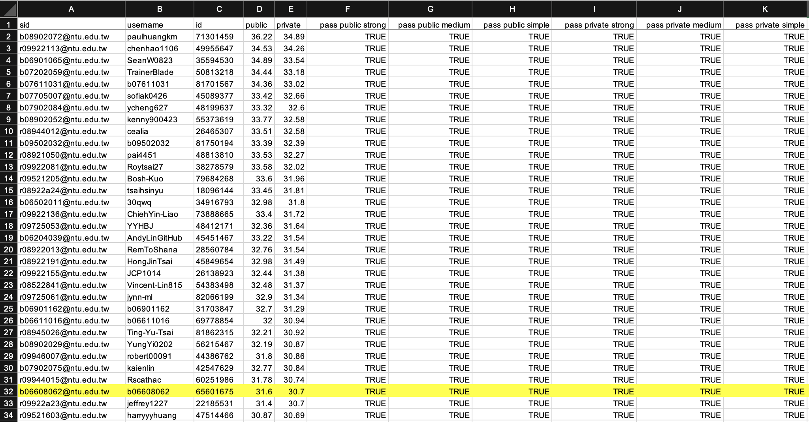

# Machine Translation

## Overview

This project implements an end-to-end **Neural Machine Translation (NMT)** system for **English → Traditional Chinese**, built entirely with **fairseq**. The model translates English sentences into Chinese by first encoding the English sequence into contextual representations using a Transformer **encoder**, and then generating the Chinese output using a **decoder** that performs **self-attention followed by cross-attention over the encoder outputs**.


The system follows a two-stage approach:

1. **Backward Model (zh → en)** — trained on TED2020 to generate synthetic English translations for monolingual Chinese data.
2. **Forward Model (en → zh)** — trained on the combination of original parallel data and synthetic data created from back-translation.

### Dataset Summary

- **Parallel data**: approximately **390,000** English–Chinese sentence pairs from **TED2020**.
- **Monolingual data**: approximately **780,000** Chinese sentences for **back-translation**.
- 📦 [DATA.zip](https://drive.google.com/file/d/1we1EXwFnUSaPSBK7Guljr-I0lSkmCkkn/view?usp=share_link)

---

## Experiment Setup

### Data & Preprocessing

- **Cleaning (`clean_corpus`)**

  - **English**: remove parenthetical content, strip hyphens, and normalize spacing around punctuation.
  - **Chinese**: convert full-width to half-width characters, remove parenthetical spans and underscores, normalize quotes, and separate punctuation from words.
  - Length and ratio filters remove noisy or mismatched sentence pairs.

- **Split**

  - Random **99% / 1%** split of the parallel data into **train** and **validation** sets at the sentence-pair level.

- **Subword Units**

  - Apply **SentencePiece** with **unigram** model and **joint vocabulary of 8,000 tokens** for both English and Chinese.

- **Binarization**

  - Process all preprocessed data using `fairseq_cli.preprocess` to produce multiple binary datasets under `./DATA/data-bin/XXX`,
    where `XXX` may refer to different stages such as `ted2020`, `mono`, `synthetic`, or `ted2020_with_mono`.
    Each dataset includes `dict.en.txt`, `dict.zh.txt`, and corresponding `.bin` and `.idx` files.

### Model Architecture

Use a standard Transformer encoder–decoder: the English source is encoded by a `TransformerEncoder` into contextual representations, and a `TransformerDecoder` autoregressively generates the Chinese target. **Each decoder layer applies self-attention over previously generated tokens first, then cross-attention over the encoder outputs** to align with source semantics, followed by a feed-forward block with residual connections and normalization. We use separate `nn.Embedding` tables for source and target, with shared weights between the decoder’s input and output embeddings (`share_decoder_input_output_embed=True`).

#### Backward Model (zh → en)

Used to translate Chinese monolingual sentences into synthetic English.

```python
arch_args = Namespace(
    encoder_embed_dim=512,
    encoder_ffn_embed_dim=2048,
    encoder_layers=6,
    decoder_embed_dim=512,
    decoder_ffn_embed_dim=2048,
    decoder_layers=6,
    share_decoder_input_output_embed=True,
    dropout=0.1,
)

def add_transformer_args(args):
    args.encoder_attention_heads = 8
    args.encoder_normalize_before = True
    args.decoder_attention_heads = 8
    args.decoder_normalize_before = True
    args.activation_fn = "relu"
    args.max_source_positions = 1024
    args.max_target_positions = 1024
    from fairseq.models.transformer import base_architecture
    base_architecture(arch_args)

add_transformer_args(arch_args)
```

#### Forward Model (en → zh)

The main model trained on combined real and synthetic parallel data.

```python
arch_args = Namespace(
    encoder_embed_dim=768,
    encoder_ffn_embed_dim=3072,
    encoder_layers=6,
    decoder_embed_dim=768,
    decoder_ffn_embed_dim=3072,
    decoder_layers=6,
    share_decoder_input_output_embed=True,
    dropout=0.3,
)

def add_transformer_args(args):
    args.encoder_attention_heads = 12
    args.encoder_normalize_before = True
    args.decoder_attention_heads = 12
    args.decoder_normalize_before = True
    args.activation_fn = "relu"
    args.max_source_positions = 1024
    args.max_target_positions = 1024
    from fairseq.models.transformer import base_architecture
    base_architecture(arch_args)

add_transformer_args(arch_args)
```

### Hyperparameters

- **Epochs**: backward model — 30 epochs; forward model — 48 epochs
- **Batch Size**: token-based batching (`max_tokens=8192` for backward, `4096` for forward)
- **Gradient Accumulation**: 2 mini-batches per update
- **Learning Rate**: scheduled with **Noam** warm-up + inverse square-root decay (`factor=2.0`, `warmup=4000`)
- **Optimizer**: `AdamW`
- **Scheduler**: **Noam** (warm-up → inverse square-root decay)
- **Loss Function**: `LabelSmoothedCrossEntropy` with **ε = 0.1**

---

## Techniques Used

### Data Cleaning

Thorough text normalization and length filtering significantly reduce noise and improve alignment quality.

### Subword Units

Applying **SentencePiece (unigram)** prevents out-of-vocabulary issues and aligns subword spaces between English and Chinese.

👉 [Hugging Face LLM Course – Subword Tokenization (Unigram)](https://huggingface.co/learn/llm-course/zh-TW/chapter6/7)

### Stronger Transformer

Replaces RNN/GRU with a **Transformer** architecture that leverages **self-attention and cross-attention** to capture long-range dependencies in both languages.

### Teacher Forcing

During training, the decoder receives the ground-truth token from the previous step to stabilize convergence and accelerate learning.

### Beam Search

Inference uses **beam size = 5**, balancing translation quality and computational efficiency.

### LabelSmoothedCrossEntropyCriterion

Encourages smoother output distributions by reducing model overconfidence, mitigating overfitting, and handling translation ambiguity.

### Learning Rate Scheduling

**Noam** schedule for stable Transformer training:

$$
\text{lr} = d_\text{model}^{-0.5} \cdot
\min(\text{step}^{-0.5},\; \text{step} \cdot \text{warmup}^{-1.5})
$$

> LR curve visualization:



### Mixed Precision & Gradient Control

- **AMP (`GradScaler`)** ensures numerical stability in FP16.
- **Gradient Accumulation** combines multiple mini-batches before each update.
- **Gradient Clipping (`clip_norm=1.0`)** prevents exploding gradients.
- **Token-level averaging** normalizes gradients by sample size for consistent updates.

### Checkpoint Averaging

Averages the **last 5 checkpoints** to form a lightweight ensemble that improves BLEU consistency.

### Back-Translation

1. Train the **zh→en** model.
2. Use it to translate monolingual Chinese sentences into English.
3. Merge the synthetic (en, zh) pairs into the training corpus.
4. Retrain the larger **en→zh** model for substantial BLEU gains.

---

## Results

| Metric               | Score         |
| :------------------- | :------------ |
| **Public BLEU**      | **31.6**      |
| **Private BLEU**     | **30.7**      |
| **Leaderboard Rank** | **31 / 1110** |



---

## How to Reproduce

1. **Clone the repository**

   ```bash
   git clone https://github.com/b06608062/NTU-2021-Machine-Learning-HW5-Machine-Translation.git
   cd NTU-2021-Machine-Learning-HW5-Machine-Translation
   ```

2. **Download and extract the `DATA.zip` to the project root**

3. **Create and activate the virtual environment**

   ```bash
   conda create -n mlhw5py39 python=3.9 -y
   conda activate mlhw5py39
   python -m pip install --upgrade pip
   ```

4. **Install dependencies**

   ```bash
   # https://pytorch.org
   pip install torch --index-url https://download.pytorch.org/whl/cu126
   conda install -y numpy matplotlib tqdm sentencepiece
   git clone https://github.com/pytorch/fairseq.git
   cd fairseq
   git checkout 9a1c497
   pip install .
   pip install --upgrade "omegaconf==2.1.1" "hydra-core==1.1.2"
   pip install "numpy==1.23.5"
   cd ..
   ```

5. **Train models**

   ```bash
   python HW5_backward.py
   python HW5_forward.py
   ```
